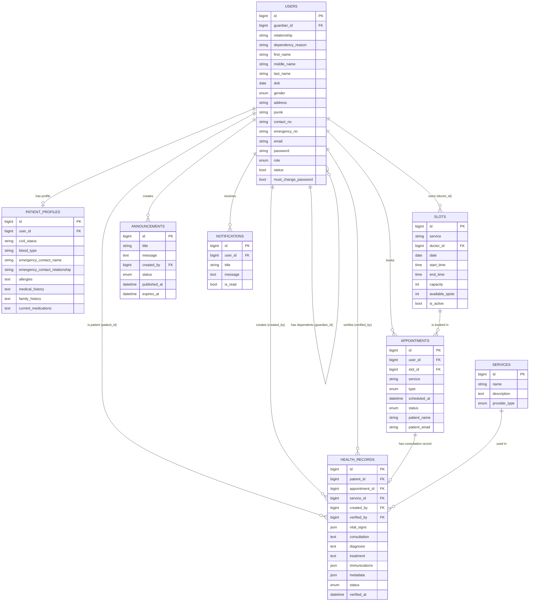

```mermaid
erDiagram

    USERS {
        bigint id PK
        bigint guardian_id FK
        string relationship
        string dependency_reason
        string first_name
        string middle_name
        string last_name
        date   dob
        enum   gender
        string address
        string purok
        string contact_no
        string emergency_no
        string email
        string password
        enum   role
        bool   status
        bool   must_change_password
    }

    PATIENT_PROFILES {
        bigint id PK
        bigint user_id FK
        string civil_status
        string blood_type
        string emergency_contact_name
        string emergency_contact_relationship
        text   allergies
        text   medical_history
        text   family_history
        text   current_medications
    }

    SERVICES {
        bigint id PK
        string name
        text   description
        enum   provider_type
    }

    SLOTS {
        bigint id PK
        string service
        bigint doctor_id FK
        date   date
        time   start_time
        time   end_time
        int    capacity
        int    available_spots
        bool   is_active
    }

    APPOINTMENTS {
        bigint id PK
        bigint user_id FK
        bigint slot_id FK
        string service
        enum   type
        datetime scheduled_at
        enum   status
        string patient_name
        string patient_email
    }

    HEALTH_RECORDS {
        bigint id PK
        bigint patient_id FK
        bigint appointment_id FK
        bigint service_id FK
        bigint created_by FK
        bigint verified_by FK
        json   vital_signs
        text   consultation
        text   diagnosis
        text   treatment
        json   immunizations
        json   metadata
        enum   status
        datetime verified_at
    }

    ANNOUNCEMENTS {
        bigint id PK
        string title
        text   message
        bigint created_by FK
        enum   status
        datetime published_at
        datetime expires_at
    }

    NOTIFICATIONS {
        bigint id PK
        bigint user_id FK
        string title
        text   message
        bool   is_read
    }

    %% Relationships
    USERS ||--o| PATIENT_PROFILES : "has profile"
    USERS ||--o{ USERS : "has dependents (guardian_id)"
    USERS ||--o{ APPOINTMENTS : "books"
    USERS ||--o{ SLOTS : "owns (doctor_id)"
    USERS ||--o{ HEALTH_RECORDS : "is patient (patient_id)"
    USERS ||--o{ HEALTH_RECORDS : "creates (created_by)"
    USERS ||--o{ HEALTH_RECORDS : "verifies (verified_by)"
    USERS ||--o{ ANNOUNCEMENTS : "creates"
    USERS ||--o{ NOTIFICATIONS : "receives"

    SLOTS ||--o{ APPOINTMENTS : "is booked in"
    APPOINTMENTS ||--o| HEALTH_RECORDS : "has consultation record"
    SERVICES ||--o{ HEALTH_RECORDS : "used in"
```

